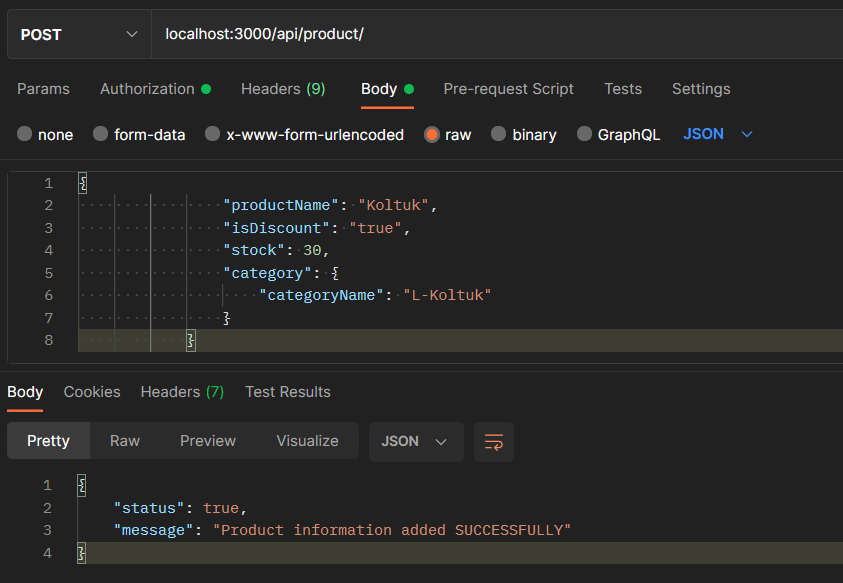
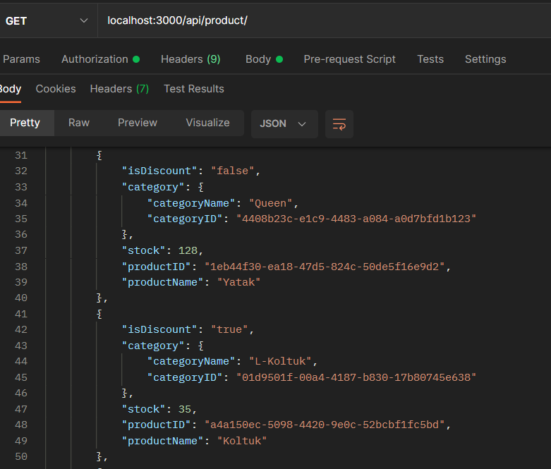
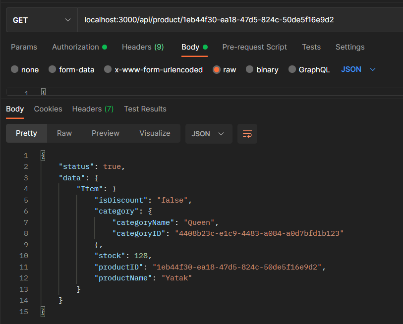
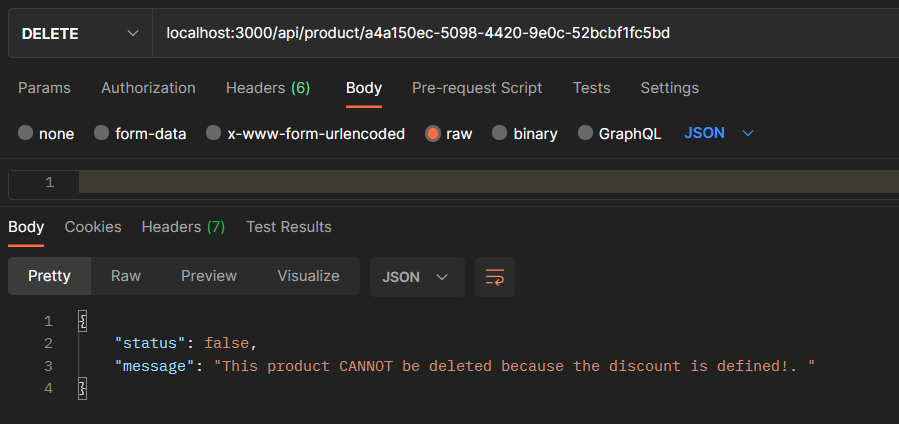

# Basic CRUD Operations with DynamoDB and Node.js
# Ödev İsterleri
- Product tablosuna ürün ekleyen **POST** endpointi  
    + Product tablosunda yer alması gereken özellikler:  
    ```
    {
        productId: string,
        stock: number,
        productName: string,
        isDiscount: boolean,
        category: {
            categoryId: number,
            categoryName: string,
            }
    }

    ```  
- Eklenen tüm ürünleri çeken bir **GET** endpointi  
    + Tüm ürünler içerisinde *productID*'ye göre query params ile filtreleme yapılacak şekilde endpoint  
    + Tüm ürünlerin içerisinden üzerinde *discount* olan ürünlere göre filtreleme yapacak endpoint  
- *productID* ile herhangi bir product'ı silecek **DELETE** endpointi  
***NOT:*** Üzerinde isDiscount olan herhangi bir product silinmemeli, hata dönmeli.  
- Herhangi bir product'ın stoğunu değiştirecek **UPDATE** servisi yazınız.  

# Teknolojiler

Client: Postman  
Server: Node, Express  
Packages: Express, Nodemon, AWS-sdk, uuid, dotenv  
Data Base: AWS DynamoDB  

# Directory Structure
```  
+---controllers  
|   |       Product.js  
+---routes  
|   +---product  
|   |       product.js      
|   |   api.js  
+---services  
|   |       product.js  
|   index.js  
|   package.json  
|   package-lock.json  
|   config.json
|   .env
+---node_modules
|   .gitignore
```

* alttaki tüm adımlar için apı yazımı ekle. postman çıktısını ss ekle. 

# Setup Kurulumu  

## Ürün ekleme
```
localhost:3000/api/product      //POST
```
```
{
    "productName": "Koltuk",
    "isDiscount": "true",
    "stock": 35,
    "category":{
        "categoryName": "L-Koltuk"
    }
}
```


</br>  

## Eklenen Tüm Ürünleri Getir
```
localhost:3000/api/product/     //GET
```


</br>  

## productID Baz Alarak Getir
```
localhost:3000/api/product/{productID}     //GET
```


</br>  

## isDiscount Baz Alara Getir 
```
localhost:3000/api/product/{productID}     //GET
```
</br>  

## productID Baz Alara Ürün Sil
**NOT:** isDiscount "true" ise silinmemeli, hata dönmemeli.
```
localhost:3000/api/product/{productID}     //DELETE
```


</br>  

## Product Stock Bilgisini Güncelle
```
localhost:3000/api/product/{productID}     //UPDATE
```
