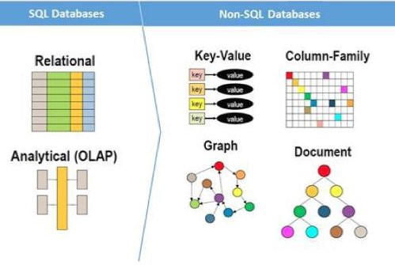

# NoSQL ve SQL Arasındaki Farklar  
# Ödev İsterleri
- NoSQL ve SQL arasındaki farkları anlattığınız bir yazı yazınız.  

## İlişkisel Veritabanı Sistemleri (Relational Database System)
Günümüzde en çok kullanılan veri tabanı sistemlerinden biridir. Satır ve sütunların oluşturduğu birbirleriyle ilişkili olan tablolardan meydana gelir. Her bir tablo belirli yapıya uygun verileri saklamak için tasarlanır. İlişkisel veritabanları, verileri aralarında mantıksal bağlantılar bulunan satırlar (attributes) ve tablolardaki kayıtlar (records) olarak modeller
**SQL**, ilişkisel veritabanlarıyla arayüz oluşturmak için kullanılan programlama dilidir.  

## İlişkisel Olmayan Veritabanı Sistemi (Non-Relational Database System)
NoSQL, ilişkisel veri tabanı sistemlerine alternatif bir çözüm olarak ortaya çıkmıştır. Yatay olarak ölçeklenebilen bir veri depolama sistemidir. Çok büyük verilerin depolanması ve yazılmasında ilişkisel veri tabanlarının eksik kaldığı noktalarda, *yatay ölçekleme* yapan *dağıtık* **NoSQL** çözümleri getirilmiştir. Yani, veritabanına ilişkin problemlerden biri olan ölçek sorununa, diğer çözümlerin içinde en iyi çözüm olanı NoSQL’dir. **Amazon** bu gereksinimi **DynamoDB** ile, **Google** ise **Big Table** isimli NoSQL veri tabanı sistemi ile çözmektedir. NoSQL veri tabanının tercih edilme sebepleri özellikle *hız* ve *yatay büyüme* ile gereksiz ek *maliyetten kurtulma* istekleridir. NoSQL göreceli olarak yeni bir gelişmedir fakat *e-ticaret*, *internet arama motorları* ve *sosyal ağlar* gibi büyük ölçekli internet uygulamaları için güvenirliği kanıtlanmıştır. 

   

## SQL ve NoSQL Arasındaki Pratik Farklar
> *SQL* veritabanları çok satırlı işlemler için daha iyidir, *NoSQL* ise belgeler veya JSON gibi yapılandırılmamış veriler için daha iyidir.   

SQL ve NoSQL arasındaki genel 5 fark aşağıda detaylandırılmıştır.  

### Dil, Sözdizimi (Language)
***SQL*** yaygın kullanılan bir dildir. Karmaşık sorgular için çok uygundur. Ancak, kullanıcının önceden tanımlanan bir tablo şemasında çalışmasını kısıtlar ve verileri kullanılmadan önce düzenlemek ve anlamak için fazla çaba sarf etmek gerekir. Ortak bir sözdizimine sahip ve aynı dilbilgisini paylaşan bir çok yapılanması vardır.  

***NoSQL*** ise dinamik şemaları, alternatif yapıların genelde yan yana temsil edilmesine izin vererek daha fazla esnekliğe teşvik eder. Daha fazla özgürlük ve veritabanları arasında değişen sözdizimi olasılığı vardır. Ancak, NoSQL dilleri SQL’in sağladığı standart arabirimden yoksundur. Bu yüzden daha karmaşık sorguların yürütülmesi zordur. NoSQL dilleri arasındaki tutarlılık çok daha azdır. Birçok NoSQL veritabanı, belirli yapılar ve yeteneklerle sınırlandırılmış benzersiz bir veri işleme diline (unique data manipulation language) sahiptir.  

### Ölçeklenebilirlik (Scalability):
***SQL*** veritabanı, donanım işlem gücünü artırarak dikey ölçeklenebilir. Yatay olarak da ölçeklenebilir fakat parçalama veya bölümleme mantığı kullanıcı sorumluluğundadır ve iyi desteklenmez.  

***NoSQL*** veritabanları, ek sunucular veya düğümlerle yatay olarak daha iyi ölçeklenen bir master-slave mimarisi kullanır. Dikey ölçeklenme seçeneği de mevcuttur. Daha verimli veri yapıları kullanılarak yapılan tasarruflar, ölçeklenebilirlikteki farklılığı örtbas edebilir.  

###  Yapı (Structure)  
  

***SQL***, veritabanı şemaları her zaman tutarlılık ve bütünlülük ile ilgili kurallarla ilişkisel, tablo halindeki verileri temsil eder. Sütunlar (attributes) ve satırlar (records) içeren tablolar içerir ve anahtarların (keys) sınırlı mantıksal işlevleri vardır.  

***NoSQL***, veritabanlarının bir biçime bağlı kalması gerekmez. Ancak, genelde dört ana kategoriden birine uyar:  

 - Sütun yönelimli (column-oriented) veritabanları, satır yönelimli ilişkisel veritabanı yönetimi sistemini (RDBMS) transpose ederek yüksek boyutlu verilerin verimli şekilde depolanmasını sağlar.  
 - Anahtar-Değer depoları (key-value stores) her biri benzersiz bir anahtarla çeşitli nesnelere erişen sözlüklerdir.  
 - Belge depoları (document stores) yarı yapılandırılmış verileri tutar.  
 - Grafik veritabanları (graph databases) ilişkiler kavramını (nesneler arasındaki doğrudan bağlantıları) belgere ekler ve büyük ölçüde bağlantılı veri kümelerinin hızlı geçişini sağlar.  

### Özellikler (Properties):
***SQL***, RDBMS 4 ana "ACID" özelliği sergiler:  
 - Atomicity: Tüm işlemlerin başarılı veya tamamen başarısız olması  
 - Tutarlılık (consistency) 
 - Izolasyon: Eş zamanlı işlemlerin birbirini etkilemesini önler  
 - Dayanıklılık (durability)  

***NoSQL***, bu teknoloji dağıtık (distributed) bir veritabanında aynı anda yanlızca iki özelliğin garanti edilebileceğini söyleyen "CAP" teoremine bağlıdır:  
 - Tutarlılık (consistency): ACID özelliklerinden farklı olarak her istek en son sonucu veya bir hatayı alır.  
 - Kullanılabilirlik (availability): Her isteğin hatasız bir sonucu vardır.  
 - Bölme Toleransı (Partition Tolerance): Düğümler arasındaki bir gecikme veya kayıp, systemin çalışmasını kesintiye uğratmaz.  

### Destek ve Topluluklar (Support and Communities)
***SQL*** veritabanları büyük toplulukları, kararlı kod tabanlarını ve kanıtlanmış standartları temsil eder. Yeni başlayanları desteklemek için uzmanlar mevcuttur. Ayrıca, işletim sistemlerinden mimarilere ve programlama dillerine kadar çoğu büyük platformda mevcuttur.  
***NoSQL*** teknolojileri hızla benimsense de toplulukları daha küçük ve daha bölünmüş durumdadır. Açık sistemlerden yararlanılır. İşletim sistemleri, mimariler ve programlama dilleri uyumluluğu için NoSQL için daha geniş çapta değişir ve bağımlılıkların daha dikkatli araştırılması gerekir.  

   

## Hangi Tip Veritabanını Kullanılmalıdır?
Bu ayrım ihtiyaca göre değişiklik göstermektedir. Eğer daha karmaşık sorgular yapılması gerekiyor ve ileride uygulamanın trafik hacmi ve veri tipleri için fazla bir değişiklik beklenmiyorsa ilişkisel veritabanlarından birini (SQL) seçmek daha doğru olabilir. Öte yandan, dinamiklik ve esneklik beklentisi olan bir durum için ise NoSQL tercih edilebilir.  

   

## Özet

|**SQL** | **NoSQL**|
|--------|----------|
|İlişkiseldir. | İlişkisel değildir.|
| Çok satırlı, karmaşık ve ilişkili işlemler için daha uygundur. | Belgeler veya JSON gibi yapılandırılmamış veriler için daha iyidir. |
| Tablo tabanlıdır. | Belge, anahtar/değer, grafik veya geniş sütun depolarıdır. |
| Esnek değildir. | Esneklik sağlar. |
| Standart ve yapılandırılmış sorgu dili kullanır. Önceden tanımlanmış bir şemaya sahiptir. | Ortak bir sözdizimi yoktur, unique yapıdadır. Yapılandırımamış veriler için dinamik şemalara sahiptir. |
| Dikey veri ölçeklenmesi | Yatay veri ölçeklenmesi | 
| Kullanım alanına göre daha maliyetli sayılabilir. | Hız ve yatay büyüme ile gereksiz ek maliyetten kurtulma söz konusudur. |
| Tutarlılık ve bütünlük çok önemlidir. | Bir biçime bağlı kalması gerekmez. | 

   

## References
- [Integrateio- SQL vs NoSQL: 5 Critical Diffrences](https://www.integrate.io/blog/the-sql-vs-nosql-difference/)  
- [talend-SQL vs NoSQL:Differences, Databases, and Decisions](https://www.talend.com/resources/sql-vs-nosql/)  
- [Medium-Rıdvan Akca- Sql vs NoSQL](https://medium.com/hardwareandro/sql-veritabanlar%C4%B1-vs-nosql-veritabanlar%C4%B1-14216d894539#:~:text=Sql%20veritabanlar%C4%B1%20sabit%20sat%C4%B1r%20ve,da%20grafik%20olu%C5%9Fturma%20%C5%9Feklinde%20%C3%B6zetlenebilir.)  
- [Guru99-Richard Peterson-SQL vs NoSQL: What’s the Difference Between SQL and NoSQL](https://www.guru99.com/sql-vs-nosql.html#:~:text=Comparing%20SQL%20vs%20NoSQL%20database,%2Dvalue%20pairs%2C%20graph%20databases.&text=SQL%20databases%20have%20a%20predefined,dynamic%20schema%20for%20unstructured%20data.)  
- [IBM Cloud-SQL vs NoSQL](https://www.ibm.com/cloud/blog/sql-vs-nosql)  
- [AWS-Relational (SQL) or NoSQL?](https://docs.aws.amazon.com/amazondynamodb/latest/developerguide/SQLtoNoSQL.WhyDynamoDB.html)  

